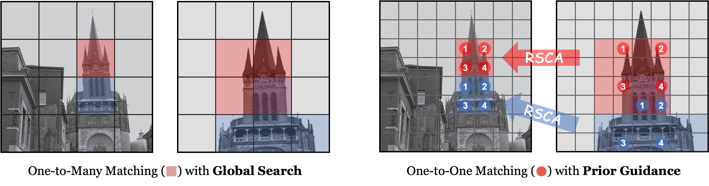

<div align="center">
<h1><ins>CasP</ins> 🪜</h1>
<h2>
    Improving Semi-Dense Feature Matching Pipeline Leveraging<br>
    Cascaded Correspondence Priors for Guidance
</h2>
<h3>ICCV 2025</h3>
<p>
    <b>Peiqi Chen<sup>1*</sup> · Lei Yu<sup>2*</sup> · Yi Wan<sup>1&dagger;</sup> Yingying Pei<sup>1</sup> · Xinyi Liu<sup>1</sup> · Yongxiang Yao<sup>1</sup></b><br>
    <b>Yingying Zhang<sup>2</sup> · Lixiang Ru<sup>2</sup> · Liheng Zhong<sup>2</sup> · Jingdong Chen<sup>2</sup> · Ming Yang<sup>2</sup> · Yongjun Zhang<sup>1&dagger;</sup></b>
</p>
<p>
    <sup>1</sup>Wuhan University&emsp;&emsp;&emsp;<sup>2</sup>Ant Group<br>
    *Equal contribution&emsp;&emsp;&emsp;&dagger;Corresponding author
</p>
<div style="display: flex; justify-content: center; align-items: flex-start; flex-wrap: wrap;">
    <a href="https://arxiv.org/abs/2507.17312"></a>&emsp;
    <a href="LICENSE"></a>
</div>
<div style="display: flex; justify-content: center; align-items: flex-start; flex-wrap: wrap;">
    <a href="https://huggingface.co/spaces/pq-chen/CasP"></a>
</div>
<p>
    <br>
    <em>CasP decomposes the matching stage into two progressive layers, with the former layer providing the one-to-many priors that constrain the search range of the latter.</em>
</p>
</div>

## Update

- **[2025-08]** The inference code has been released, and an online demo is available on [Hugging Face Spaces](https://huggingface.co/spaces/pq-chen/CasP), which includes the outdoor model trained on MegaDepth and the fine-tuned model on MINIMA.
- **[2025-07]** CasP has been accepted to ICCV 2025 as a **highlight** paper.

> **Note:** Due to disclosure restrictions imposed by the funding agency, model weights are only available through the demo. For any non-commercial request, please contact the corresponding author at yi.wan@whu.edu.cn.

## Introduction

This repository hosts the official implementation of CasP, a cascaded semi-dense feature matching pipeline designed for superior accuracy and efficiency.

## Benchmark

<details open>
<summary><b>[MegaDepth-Synthetic-1500 (MD-Syn-1500)]</b></summary>
<p>
    Here are the results as Area Under the Curve (AUC) of the relative pose error at 10 degree:
</p>

| Method         | Fine-tuned | RGB-Infrared | RGB-Depth | RGB-Normal | RGB-Event | RGB-Sketch | RGB-Paint |
|----------------|------------|--------------|-----------|------------|-----------|------------|-----------|
| LoFTR          | ❌         | 12.58        | 0.44      | 12.07      | 12.43     | 54.82      | 12.22     |
| ELoFTR         | ❌         | 14.59        | 0.79      | 21.67      | 20.39     | 61.09      | 25.11     |
| CasP           | ❌         | **22.53**    | **1.20**  | **30.25**  | **35.51** | **62.92**  | **39.70** |
| MINIMA_LoFTR   | ✅         | 32.36        | 28.81     | 44.26      | 32.74     | 53.54      | 15.45     |
| MINIMA_ELoFTR  | ✅         | 26.36        | 32.26     | 47.47      | 30.72     | 59.63      | 27.02     |
| MINIMA_CasP    | ✅         | **43.87**    | **40.55** | **53.64**  | **40.06** | **60.30**  | **40.76** |
</details>

<details open>
<summary><b>[Zero-Shot Cross-Modality Matching]</b></summary>
<p>
    Here are visualizations of image registration across unseen modalities, produced by our model fine-tuned on <a href="https://github.com/LSXI7/MINIMA">MINIMA</a>:
</p>
<table>
    <tr>
        <td align="center">
        <br>Optical-Point Cloud
        </td>
        <td align="center">
        <br>Optical-SAR
        </td>
        <td align="center">
        <br>Optical-Vector Map
        </td>
    </tr>
</table>
</details>

## Citation

If you find any of the ideas or the code useful for your research, please consider citing our paper:

```bibtex
@inproceedings{chen2025casp,
    title={CasP: Improving Semi-Dense Feature Matching Pipeline Leveraging Cascaded Correspondence Priors for Guidance},
    author={Chen, Peiqi and Yu, Lei and Wan, Yi and Pei, Yingying and Liu, Xinyi and Yao, Yongxiang and Zhang, Yingying and Ru, Lixiang and Zhong, Liheng and Chen, Jingdong and Yang, Ming and Zhang, Yongjun},
    booktitle={ICCV},
    year={2025}
}
```

## License

The pre-trained models of CasP and the code provided in this repository are released under the [Apache-2.0 license](LICENSE).
